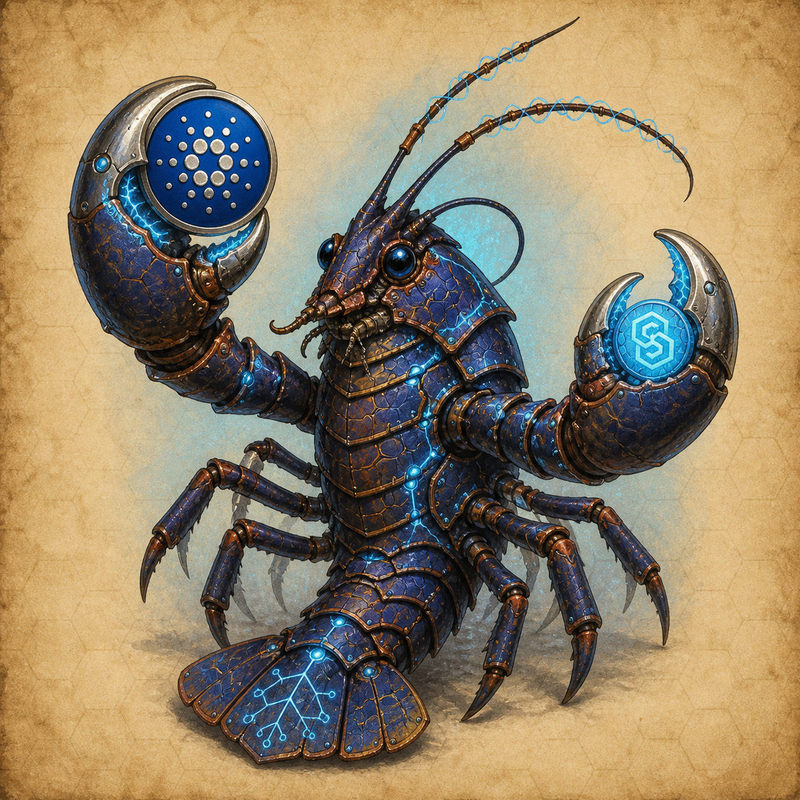
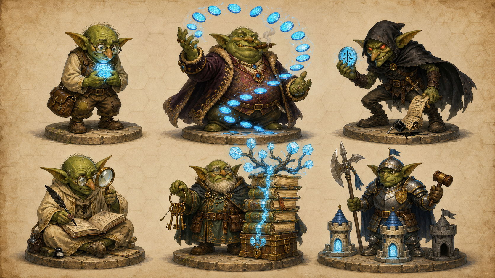

# Charles Hoskinson — experiments

Working space for in-progress research and prototypes. Two pieces here belong to one program: **Ouroboros Omega**, a clean-slate post-quantum redesign of Cardano with cryptographic continuity to every prior era of the chain.

| Subdirectory | What it is | Status |
|---|---|---|
| [`omega-commitment/`](./omega-commitment/) | Rust workspace producing the Ω-Commitment, a single hash that captures the entire pre-fork Cardano state across 7 sub-trees | v0.10.0-rc1 (Blake3), 292 tests |
| [`cardano-wiki/`](./cardano-wiki/) | LLM-maintained research wiki: Cardano consensus, EUTXO, Plutus, Hydra, Mithril, Leios, Voltaire governance, plus the Omega program design and the v1.0 ingestion plans | Living document |

The four sibling documents at repo root frame the program at decreasing levels of abstraction. [`README.md`](./README.md) (this file) is the entry point. [`GOALS.md`](./GOALS.md) lists what the program is trying to accomplish across all twelve tracks. [`ARCHITECTURE.md`](./ARCHITECTURE.md) is the deep-dive on the cryptographic construction, the consensus stack, the zkVM layer, and the v1.0 ingestion pipeline. [`RESEARCH-QUESTIONS.md`](./RESEARCH-QUESTIONS.md) treats the ten genuinely-open issues from the design spec at length.

## What is Ouroboros Omega?

Cardano shipped in 2017 against an elliptic-curve stack: Ed25519 for ordinary signatures, Praos VRF for slot-leader election, KES for forging keys, and BLS12-381 underneath Mithril certificates. All four break against a sufficiently large quantum computer, and the timeline for that machine is no longer hand-wavy. NIST finalised its first batch of post-quantum standards in 2024. Operational target dates inside national-security agencies for finishing PQ migrations now sit between 2030 and 2035. That is one Cardano upgrade cycle, and a chain with persistent state has to plan for the migration window to be the entire history of the chain rather than just the moment a cryptographically relevant quantum computer appears. Two honest options for the migration shape: layer hash-based or lattice-based primitives over the existing curve-based stack and pay the compatibility tax forever, or build the new chain you would have built in 2017 if you had known what you know now. Omega chooses the second.

The trickiest part of a clean-slate fork is the existing state. Cardano has roughly ten million UTxOs, 2.5 million stake credentials, 2,940 stake pools, a thousand DReps, and eight years of block history. None of that should disappear when the new chain starts. None of it should sit in Omega's genesis ledger either, pre-loaded and ready to be re-validated by Omega's nodes, because that would force every Omega validator to carry the entire historical weight of Cardano forever. The Ω-Commitment is the bridge primitive that resolves the tension. It is one Merkle root over seven sub-trees of pre-fork state (UTxOs, block headers, transaction index, native token policies, scripts, stake state, governance state), published once in Omega's genesis block, after which Omega's ledger starts empty. State migration is pull-based: a holder who wants their old UTxO back submits a `claim_utxo` transaction with a Merkle membership proof against the published root, and a Plonky3 verifier inside Omega's ledger confirms the proof and credits the address. Dust addresses that nobody bothers to claim cost the new chain nothing.

The full design is a four-layer post-quantum stack rather than just a commitment. Layer one is this repository's commitment-tooling work (track T1) plus the on-chain verifier circuit (T6) that consumes claims. Layer two is the consensus stack: Ouroboros Crypsinous ([eprint 2018/1132](https://eprint.iacr.org/2018/1132)) for shielded VRF and encrypted mempool, Ouroboros Chronos ([eprint 2019/838](https://eprint.iacr.org/2019/838)) for permissionless proof-of-stake clock synchronisation, Minotaur ([eprint 2022/104](https://eprint.iacr.org/2022/104)) for multi-resource composition combining stake with storage. Layer three is the smart-contract execution model: [LFDT-Nightstream/Starstream](https://github.com/LFDT-Nightstream/Starstream), a UTXO-based zkVM with coroutines as the primitive, native folding scheme, and Goldilocks plus Poseidon2 in-circuit. Layer four is optional infrastructure: a Filecoin-fork mirror partnerchain under the [Cardano partnerchains SDK](https://github.com/input-output-hk/partner-chains) that stores the snapshot archive and provides Minotaur's storage-resource input, with storage providers earning both retrieval fees and Omega-side block rewards. All four layers use the same primitive set: Blake3-256, SHA3-256, Poseidon2 in-circuit, Goldilocks field, [SLH-DSA](https://csrc.nist.gov/pubs/fips/205/final) / [ML-DSA](https://csrc.nist.gov/pubs/fips/204/final) / FN-DSA for signatures, Plonky3 STARKs (no trusted setup), no curves anywhere.

The protocol explicitly forbids backdoors. There are no escrow keys, no court-recovery mechanisms, no designated-viewer roles, no master-recovery paths, no regulator-friendly disclosure surface. The reasoning is a one-liner: a global cryptographic network whose code is auditable everywhere cannot have a backdoor that only some jurisdictions get to use, because every jurisdiction will demand its own. Three layers of constitutional binding enforce the no-backdoor stance. Layer one is the [CIP-1694](https://cips.cardano.org/cips/cip1694/)-shaped guardrails script, which statically rejects any parameter-update proposal that would replace the genesis commitment, introduce a master / recovery / escrow key, or remove the [PLUME](https://eips.ethereum.org/EIPS/eip-7524) nullifier requirement. Layer two is the Plonky3 verifier circuit itself: invariants compiled into hardware-style constraints rather than into governance policy, beyond reach of any vote. Layer three is the social-fork pre-commitment: the wallet ecosystem decides which chain is "Omega" via reproducible-build attestations, so a captured-stake supermajority that votes to insert a backdoor produces a different chain that wallets refuse to recognise. Steem-to-Hive is the operational template for layer three.

## Transaction flow: Cardano UTxO → Omega Starstream UTxO

The diagram below traces a single UTxO across the full lifecycle: Cardano-side normal use, the one-time snapshot and genesis, the post-fork claim, and the resulting Omega-side Starstream UTxO. The five phases name what is computed and what trust boundary applies at each step.

```
┌────────────────────────────────────────────────────────────────────────────────┐
│ PHASE A — Pre-fork (Cardano-side, normal operation)                            │
└────────────────────────────────────────────────────────────────────────────────┘

  Alice holds an Ed25519 keypair on Cardano.
  She signs Cardano transactions; eventually her holdings settle at:

    UTxO_final = ( tx_id_F, output_index_F,
                   address_F = h(Ed25519_pk_A),
                   value_F   = X ADA + asset_bundle_F,
                   datum_F? script_ref_F? )

  This UTxO sits in the Cardano ledger at slot S_final, block B_final.

┌────────────────────────────────────────────────────────────────────────────────┐
│ PHASE B — Snapshot boundary (off-chain, one-time, the work in this repo)       │
└────────────────────────────────────────────────────────────────────────────────┘

  Operator picks block height H ≥ tip - k (k = 2160 stability depth).
  Trust boundary #1: Mithril certificate over the snapshot bytes.

      omega-utxo-snapshot                       cardano-cli conway query
      (pallas-network LSQ,                      ledger-state --output-json
       BlockQuery::GetUTxOWhole)
            │                                            │
            ▼                                            ▼
      utxo_*.cbor (multi-GB)                      ledger_state_*.json (~2 GB)
            │                                            │
            └────────────────────┬───────────────────────┘
                                 ▼
                         omega-ingest
                         (one parser per sub-tree:
                          UTxO, header, tx-idx, token, script, stake, gov)
                                 │
                                 ▼
              Sorted leaf set per sub-tree (deterministic, lexicographic)
                                 │
                                 ▼
        For each sub-tree i, for each leaf L_j at canonical index idx_j:
          leaf_hash_j = H_blake3("omega:v2:leaf" || i || idx_j || len || payload_j)
        Build binary Merkle tree, sort, pad to next power of two with
        leaf_hash_v2(i, EMPTY_INDEX_SENTINEL=u64::MAX, &[]).
        Internal nodes:
          node = H_blake3("omega:v2:node" || left || right)
        Yields per-sub-tree root: root_i.
                                 │
                                 ▼
        bundle_blake3 = H_blake3(root_1 || root_2 || ... || root_7)
        bundle_sha3    = H_sha3   (root_1 || root_2 || ... || root_7)
                                 │
                                 ▼
              Ω-Commitment = (bundle_blake3, bundle_sha3)   ← 64 bytes total

┌────────────────────────────────────────────────────────────────────────────────┐
│ PHASE C — Genesis publication (Omega-side, one-time, mass-MPC)                 │
└────────────────────────────────────────────────────────────────────────────────┘

  Mass-MPC ceremony (Cardano-user participation, Zcash-Sapling style).
  Trust boundary #2: m-of-n attestations; one honest contributor invalidates
                     a backdoored ceremony.

  Omega genesis block pins:
  ┌──────────────────────────────────────────────────────────┐
  │ ω-commit:    (bundle_blake3, bundle_sha3)               │
  │ snap-block:  Cardano block hash B_H at height H          │
  │ snap-cert:   Mithril certificate hash                    │
  │ ceremony:    mass-MPC transcript hash                    │
  │ params:      Plonky3 (FRI rate, queries),                │
  │              hash domain tags ("omega:v1:leaf|node"),    │
  │              SLH-DSA / ML-DSA / FN-DSA parameter sets,   │
  │              Crypsinous + Chronos + Minotaur ω weights,  │
  │              CIP-1694 guardrails-script bytecode hash    │
  └──────────────────────────────────────────────────────────┘

  After genesis, Omega's ledger is empty. No UTxOs, no stake positions,
  no DReps, no native token policies. Every Cardano-era piece of state
  exists only as a Merkle leaf inside ω-commit until somebody claims it.

┌────────────────────────────────────────────────────────────────────────────────┐
│ PHASE D — Post-fork claim (per holder, lazy, indefinite)                       │
└────────────────────────────────────────────────────────────────────────────────┘

  Alice's wallet:

    1. Derive PQ key K_pq from her Cardano BIP-39 seed:
         BIP-39 → BIP-32 → BIP-85 → seed_pq → SLH-DSA(seed_pq) = K_pq.
    2. Fetch Merkle path π for leaf_F from a snapshot service
       (multi-aggregator, Mithril-certified; mirror partnerchain or self-host).
    3. Construct claim_utxo transaction:

       PUBLIC INPUTS (visible on chain):
         • sub_tree_id = 1                       (UTxO sub-tree)
         • leaf_index  = idx_F                   (canonical index in sub-tree)
         • bundle_root = bundle_blake3          (must match ω-commit in genesis)
         • nullifier   = PLUME(K_pq,
                               "omega:v1:claim:" || sub_tree_id || idx_F)
         • recipient   = Starstream UTxO target

       PRIVATE WITNESS (inside circuit, never revealed):
         • leaf_payload_F = (tx_id_F, output_index_F, address_F,
                             value_F, asset_bundle_F, datum_F, script_F)
         • Merkle path π from leaf_F to bundle_blake3
         • PQ signature σ over (sub_tree_id || idx_F || recipient || nullifier)
         • Address pre-image data binding K_pq to address_F

       The claim is submitted to Omega's mempool (encrypted via
       Crypsinous threshold-encryption committee — see Phase E).

  Omega ledger STARK verifier (track T6) runs the Plonky3 circuit,
  checks the claim against the spent-set, then either:
    • accepts → emits Starstream UTxO (recipient, value_F, asset_bundle_F,
                                        datum_F, script_F);
                inserts (sub_tree_id, idx_F) into the nullifier set;
                burns the fee.
    • rejects → drops the claim; burns the fee.

┌────────────────────────────────────────────────────────────────────────────────┐
│ PHASE E — Omega steady state (continuous, post-genesis, all PQ)                │
└────────────────────────────────────────────────────────────────────────────────┘

  Alice now holds a native Omega Starstream UTxO. Subsequent spends are
  ordinary Omega transactions — no Merkle proof, no claim circuit, no
  Cardano-era reference. The PQ infrastructure that runs continuously:

    Crypsinous     shielded VRF, shielded stake snapshots, shielded reward
                   flows, threshold-encrypted mempool (the same committee
                   that decrypts claim transactions in Phase D).
    Chronos        permissionless PoS clock synchronisation; no external NTP.
    Minotaur       ω · β_stake + (1−ω) · β_storage  <  1/2.
    Starstream     UTxO-based zkVM, coroutines as primitive, native folding;
                   multi-claim folding produces one recursive proof regardless
                   of how many sub-trees a single holder claims from.
    Mirror chain   Filecoin-fork partnerchain, optional, archives Cardano-era
                   snapshot in chunked form; storage providers earn retrieval
                   fees + Omega block rewards via partnerchain SDK.
```

The flow extends naturally to other claim kinds. `claim_stake` resurrects a delegation position (sub-tree 6), `claim_governance` resurrects a DRep / committee role (sub-tree 7), `claim_token_policy` resurrects a native asset's mint authority (sub-tree 4), `claim_script` resurrects an on-chain script (sub-tree 5). Each follows the same Phase-D shape, with a different `sub_tree_id` and a payload type appropriate to the sub-tree. `claim_header` and `claim_tx` (sub-trees 2 and 3) are reserved for chain-anchored protocols and not exposed to ordinary holders.

## What the Plonky3 verifier proves

A `claim_utxo` transaction is accepted iff a Plonky3 STARK proof discharges the following constraints. The verifier circuit lives in track T6 and consumes the public inputs above plus the witness from the transaction.

| # | Constraint | Defends against |
|---|---|---|
| C1 | `leaf_hash = H_blake3("omega:v2:leaf" \|\| sub_tree_id \|\| leaf_index \|\| len \|\| payload)` for the disclosed witness payload | Forged leaf encoding; leaf-as-internal-node second-preimage swap |
| C2 | `leaf_index < item_count[sub_tree_id]` (item counts pinned in genesis params) | Padding-leaf forgery via the `EMPTY_INDEX_SENTINEL` sentinel |
| C3 | Walk Merkle path π one node at a time: `node_k = H_blake3("omega:v2:node" \|\| left_k \|\| right_k)` | Internal-node forgery; sibling tampering |
| C4 | Path terminates with `root_i == published per-sub-tree root for sub_tree_id` (pinned in genesis params) | Wrong sub-tree; root substitution |
| C5 | `bundle_blake3 == H_blake3(root_1 \|\| ... \|\| root_7)` against the genesis `ω-commit` | Stale commitment; cross-snapshot replay |
| C6 | PQ signature σ verifies under the address-derived public key | Credential theft; impersonation |
| C7 | `nullifier == PLUME(K_pq, "omega:v1:claim:" \|\| sub_tree_id \|\| leaf_index)` | Nullifier substitution; cross-claim aliasing |
| C8 | `nullifier ∉ ledger.nullifier_set` (off-circuit ledger state read) | Replay; double-claim |

C1-C5 are the membership half. C6-C7 are the authorisation half. C8 is the freshness half, enforced by the ledger transition rather than the circuit (the circuit cannot read mutable state). All eight together are what makes a claim final on Omega: the holder demonstrated possession of the credential, the leaf was real in the published commitment, the path to the root checks out, and the credential has not been used before.

Multi-sub-tree claims (claim_utxo + claim_stake + claim_governance for the same Cardano credential) fold into a single recursive proof via Starstream's folding scheme. The on-chain footprint is constant regardless of how many sub-trees a holder draws from. The folded proof discharges one C1-C7 instance per claim plus a single aggregation step; C8 stays per-leaf.

What the verifier does not prove: that the Cardano-side history that produced the leaf was internally consistent (Cardano's own validation handled that), that the snapshot was honestly chosen (Mithril + cross-implementation reproducibility handle that), or that the holder's Cardano-side wallet was uncompromised (out of scope; on-Omega state is final regardless of off-chain disputes).

## LoganNet — the local simulation ledger

<p align="center">
  
</p>

LoganNet is the local 3-node Raft cluster a developer spins up on one box to round-trip a Plonky3 proof end-to-end. The unit of value carried by the resurrected Starstream UTxOs on this cluster is **LGN**. Neither has any relationship to real Cardano, real Omega mainnet, or real money. LGN is local, synthetic, and worthless on purpose. If anyone shows up offering to buy or sell LGN, walk away.

The cluster runs three openraft (0.9.x) nodes on one machine. libp2p (0.55.x) listens on `127.0.0.1:{4001,4002,4003}` for Raft RPCs over TCP+Noise+Yamux+request_response. The `omega-api` HTTP surface listens on `127.0.0.1:{8001,8002,8003}` for client traffic. Each node owns one `rusqlite` database in WAL mode behind an mpsc-actor writer that serialises against openraft's state-machine apply path. Gossipsub is intentionally absent in v0.1; Raft `AppendEntries` is the authoritative broadcast layer. None of this is production-shaped — it is a developer-laptop quorum, with all the operational gotchas (mDNS LAN flooding salt, WAL truncate cron, snapshot-skew protection via channel ordering, restart-durability test) explicitly tracked.

Genesis is a synthetic Ω-Commitment pinned at startup as a JSON file. The bundle root is built via `omega-commitment-core::Tree::build_v1` over a small synthetic UTxO sub-tree; Blake3 hashing and `omega:v2:{leaf,node}` domain tags everywhere. When a `claim_utxo` applies, the verifier emits a Starstream UTxO with a `value` field — that's the LGN balance flowing on LoganNet. v0.1 caps leaf preimages at 64 bytes (one Blake3 compression block) so the soundness boundary is clean without a chunk/finalize gluing AIR; v0.2 adds the `LeafPreimageAir` for variable-length leaves.

```
                              ┌────────────────────────┐
                              │  omega-experiment CLI  │
                              │   prove / submit /     │
                              │   state / bench        │
                              └───────────┬────────────┘
                                          │  HTTP /v1/...
                  ┌───────────────────────┼───────────────────────┐
                  │                       │                       │
                  ▼                       ▼                       ▼
          ┌──────────────┐        ┌──────────────┐        ┌──────────────┐
          │  Node 1      │        │  Node 2      │        │  Node 3      │
          │              │        │              │        │              │
          │ libp2p :4001 │◄──────►│ libp2p :4002 │◄──────►│ libp2p :4003 │
          │ omega-api    │        │ omega-api    │        │ omega-api    │
          │   :8001      │        │   :8002      │        │   :8003      │
          │              │        │              │        │              │
          │ openraft 0.9 │        │ openraft 0.9 │        │ openraft 0.9 │
          │     │        │        │     │        │        │     │        │
          │     ▼        │        │     ▼        │        │     ▼        │
          │ rusqlite WAL │        │ rusqlite WAL │        │ rusqlite WAL │
          │ node1.db     │        │ node2.db     │        │ node3.db     │
          └──────────────┘        └──────────────┘        └──────────────┘
                                          │
                              ┌───────────┴───────────┐
                              │ synthetic genesis     │
                              │   bundle.json         │
                              │   (Ω-Commitment       │
                              │    + sub-tree roots   │
                              │    + item_counts)     │
                              └───────────────────────┘
```

To run a proof experiment end-to-end:

```bash
cargo build --workspace
omega-experiment genesis --out var/bundle.json --leaves 256
omega-toy-consensus run --node 1 --genesis var/bundle.json &
omega-toy-consensus run --node 2 --genesis var/bundle.json &
omega-toy-consensus run --node 3 --genesis var/bundle.json &
omega-experiment prove --commit var/bundle.json --leaf-index 42 --out var/proof.bin
omega-experiment submit --node http://127.0.0.1:8001 --proof var/proof.bin
omega-experiment state  --node http://127.0.0.1:8001
```

The full design is in [`openspec/changes/add-proof-experiment-harness/`](./openspec/changes/add-proof-experiment-harness/) (proposal + design + per-capability spec + tasks + a QA review that flagged three P0s and eight P1s, all addressed in the artifacts before this README change). The narrative pre-sketch with download lists and fork-vs-depend decisions is at [`cardano-wiki/wiki/pages/omega-testnet-e2e-plan.md`](./cardano-wiki/wiki/pages/omega-testnet-e2e-plan.md). The optional Cardano-tx-validation feature on `omega-mock-ledger` (default off) pulls in `pallas-validate = "=1.0.0-alpha.6"` so a developer can feed real preview-testnet transactions through the same pipeline as an LGN claim.

## Goblins — the agentic load mix



One human submitting one proof at a time is enough to demonstrate end-to-end soundness. It is not enough to *exercise* LoganNet under realistic load — there is no mix of well-behaved holders, adversarial replays, batched-collection whales, snapshot-service consumers, or validator outages. The Goblins are the answer: autonomous agents that role-play on LoganNet at parameterizable scale, plan their actions via local Gemma-4 E4B inference (Ollama by default; `MockLlmClient` for CI), and surface harness regressions through their failure modes. They are simulation tools, not part of the protocol. They never appear in any Omega genesis ceremony.

The framework ships six default roles. Each goblin runs an observe-plan-act loop against the same `omega-api` every other client uses; an LLM call produces a structured plan, a Rust parser maps the plan to an `Action`, the goblin submits and observes via the API. Malformed LLM output falls back to a deterministic per-role default, and a Prometheus counter tracks the rate.

| Role | What it does | Failure mode it surfaces |
|---|---|---|
| **Holder** | Picks an unclaimed leaf, builds a single-leaf `claim_utxo`, submits, observes apply | Happy-path regressions in the prover, verifier, or API |
| **Whale** | Builds a `ClaimCollection` of K leaves (K ∈ [10, 1024]); LLM picks K from observed apply latency | Batched-prove memory ceiling; per-batch verifier latency |
| **Adversary** | Replays a known-good claim, tampers a proof byte, submits malformed CBOR, attacks a wrong bundle root | Verifier soundness regressions — **the runner panics if an Adversary is accepted**, because that is impossible by design |
| **Lurker** | Subscribes to `WS /v1/events`, polls state, emits LLM-generated plain-English summaries every M ticks | Gives a human reading a 30-min log a way to skim what happened without re-deriving it from raw traces |
| **SnapshotServer** | Hosts a libp2p protocol that serves Merkle paths for holders' witness construction; stand-in for the future T5 mirror partnerchain | Wallet ⇄ snapshot-service interface drift |
| **Validator** | Runs *outside* the Raft cluster via a sidecar admin channel; requests controlled disruptions (pause node, sever network, force snapshot) | Consensus brittleness under partition, snapshot-mid-leader-change, restart-durability |

To run a goblin simulation:

```bash
ollama pull gemma4:e4b   # one-time prerequisite, ~3 GB download
omega-goblins run --holders 5 --whales 1 --adversaries 2 --lurkers 1 \
                  --snapshot-servers 1 --validators 0 \
                  --duration 30s --llm http://127.0.0.1:11434
curl -s http://127.0.0.1:9090/metrics | grep goblin_ticks_total
```

`MockLlmClient` is the default for CI: `omega-goblins run --holders 5 --llm mock --duration 30s` runs the same observe-plan-act loop against scripted plans, no GPU required. The full design is in [`openspec/changes/add-goblin-agentic-framework/`](./openspec/changes/add-goblin-agentic-framework/) (three new crates: `omega-api`, `omega-goblin-core`, `omega-goblin-runner`; modified `omega-experiment` CLI to talk to `/v1/` instead of an internal RPC).

A few cultural notes on the goblins. The Adversary is a feature: it asserts on every tick that the API rejected its submission, and crashes the runner with the offending bytes if accepted — that crash is how harness regressions get surfaced loudly rather than silently. The Validator runs outside the cluster on a separate control channel and never impersonates a Raft node, so even a misbehaving Validator cannot violate consensus invariants. The Lurker's plain-English summaries are the cheapest way to make a 30-minute simulation log human-skimmable; they cost one extra LLM call per minute and remove a lot of pain from "what just happened over there."

## How to read this repo

Both subdirectories are self-contained. To run code, go to `omega-commitment/`, run `cargo test --workspace`, and read the per-crate READMEs. The workspace has five member crates (`omega-commitment-core` library, `omega-commitment-bundle` and `omega-commitment-ingest` library+binary pairs, plus standalone `omega-commitment-cli` and `omega-utxo-snapshot` binaries) and a tests tree with three layers of golden vectors that catch the regression categories that have broken in past versions. Test count is 282 as of v0.9.1, all green.

For design rationale, go to `cardano-wiki/`. The wiki is flat by design: every page lives in `wiki/pages/`, slugged by topic, indexed in `wiki/index.md`. The single most important page is [`wiki/pages/spec-ouroboros-omega.md`](./cardano-wiki/wiki/pages/spec-ouroboros-omega.md). The 2026-05-03 cumulative design spec at [`docs/superpowers/specs/2026-05-03-omega-archive-anchored-claims-design.md`](./cardano-wiki/docs/superpowers/specs/2026-05-03-omega-archive-anchored-claims-design.md) is the canonical reference for the four-layer architecture, the no-backdoor constitutional binding, the Crypsinous + Chronos + Minotaur consensus composition, and the Starstream zkVM integration. The wiki also has a decision log at [`wiki/log.md`](./cardano-wiki/wiki/log.md), append-only and dated, where every architecture pivot, audit finding, verification result, and discovery affecting the program gets recorded. Reading the last three or four log entries gives you the current state of play more efficiently than any other artifact in the repo.

Implementation plans live under [`cardano-wiki/docs/superpowers/plans/`](./cardano-wiki/docs/superpowers/plans/). They are written in a format executable by a coding agent, but humans read them fine. The two active plans are [`2026-05-01-omega-v1.0-real-mainnet-ingestion-plan.md`](./cardano-wiki/docs/superpowers/plans/2026-05-01-omega-v1.0-real-mainnet-ingestion-plan.md) (the in-progress work, plus the 2026-05-03 architecture revision at the top) and [`2026-05-01-omega-v1.1-chain-follower-plan.md`](./cardano-wiki/docs/superpowers/plans/2026-05-01-omega-v1.1-chain-follower-plan.md) (next milestone, planned but not started). Older v0.x.x plans are in the same directory and are mostly historical.

## Architecture overview (4-lane diagram)

The diagram traces the program across four lanes: pre-fork construction (off-chain, one-time, Phase B above), genesis publication (Phase C), post-fork claim flow (Phase D), and the consensus + archive layers that run continuously after genesis (Phase E). [`ARCHITECTURE.md`](./ARCHITECTURE.md) walks through each lane in detail.

```
┌────────────────────────────────────────────────────────────────────────────────┐
│ LANE 1 — PRE-FORK CONSTRUCTION  (off-chain, one-time, this repo's scope)       │
└────────────────────────────────────────────────────────────────────────────────┘

  Cardano mainnet snapshot at epoch N (≥ k=2160 blocks deep)
        │
        ├──► Mithril certificate ◄── trust boundary #1
        ▼
  ┌─────────────────────┐   ┌──────────────────────────┐   ┌ ─ ─ ─ ─ ─ ─ ─ ─ ─ ─ ─ ┐
  │ omega-utxo-snapshot │   │ cardano-cli              │     v1.1 chain-follower
  │ (pallas-network LSQ)│   │ conway query ledger-state│   │ (pallas-network N2C   │
  │  GetUTxOWhole       │   │  --output-json           │     chain-sync)
  └──────────┬──────────┘   └────────────┬─────────────┘   └ ─ ─ ─ ┬ ─ ─ ─ ─ ─ ─ ─ ┘
             │                           │                         ┊
             ▼                           ▼                         ▼
       utxo_*.cbor              ledger_state_*.json        header_*.ndjson
                                                            tx_index_*.ndjson
             │                           │                         ┊
             └──────────────┬────────────┴─────────────────────────┘
                            ▼
                  ┌───────────────────────┐
                  │  omega-ingest         │
                  │  (per-sub-tree        │
                  │   parsers, leaf       │
                  │   canonicalisation)   │
                  └──────────┬────────────┘
                             ▼
       7 sub-trees: UTXO │ Header │ Tx-idx │ Token │ Script │ Stake │ Gov
                  (binary, fixed-arity, deterministic ordering, padded)
                             │
                             ▼
                  Per-sub-tree roots (Blake3 only)
                             │
                             ▼
                  Bundle root (Blake3 + SHA3 — drift-detection, NOT break-hedge)
                             │
                             ▼
                  Ω-Commitment = (blake3_root, sha3_root)  64 B total

┌────────────────────────────────────────────────────────────────────────────────┐
│ LANE 2 — GENESIS PUBLICATION  (one-time, mass-MPC ceremony)                    │
└────────────────────────────────────────────────────────────────────────────────┘

  Mass-MPC genesis ceremony (Cardano-user participation, Zcash-Sapling style)
                             │
                             ├──► trust boundary #2 (m-of-n attestations)
                             ▼
  Omega genesis block
  ┌──────────────────────────────────────────────────────────┐
  │ ω-commit:    (blake3_root, sha3_root)                   │
  │ snap-block:  <pinned Cardano block hash>                 │
  │ snap-cert:   <Mithril cert hash>                         │
  │ ceremony:    <mass-MPC transcript hash>                  │
  │ params:      Plonky3 (FRI rate, queries),                │
  │              hash domain tags, era bytes,                │
  │              SLH-DSA / ML-DSA / FN-DSA parameter sets,   │
  │              Crypsinous + Chronos + Minotaur weights,    │
  │              CIP-1694 guardrails-script bytecode hash    │
  └──────────────────────────────────────────────────────────┘

┌────────────────────────────────────────────────────────────────────────────────┐
│ LANE 3 — POST-FORK CLAIM  (per holder, lazy, indefinite)                       │
└────────────────────────────────────────────────────────────────────────────────┘

  Holder (PQ key derived via BIP-39 → BIP-32 → BIP-85 → SLH-DSA)
                             │
                             ▼
  Snapshot service                       (multi-aggregator, Mithril-certified;
  ─ get_path(credential, sub_tree) ──►    served by the §6.5 mirror partnerchain
                                          or by self-hosted holder infrastructure)
                             │
                             ▼
  Wallet builds claim_<kind> tx with Plonky3 proof
                             │
                             ▼
  Omega ledger
  ┌──────────────────────────────────────────────────────────┐
  │ STARK verifier (T6)                                      │
  │   • plonky3_verify(circuit, public_input, proof)         │
  │   • bundle root match against genesis ω-commit           │
  │   • PQ signature verification inside circuit             │
  │   • PLUME nullifier check (one-shot per (subtree, leaf)) │
  │   • emit Starstream UTxO output to recipient             │
  └──────────────────────────────────────────────────────────┘
                             │
                             ▼
  Resurrected state on Omega
  (UTxO, stake position, governance role, native-token policy, or script)

┌────────────────────────────────────────────────────────────────────────────────┐
│ LANE 4 — CONSENSUS + ARCHIVE  (continuous, post-genesis, all PQ)               │
└────────────────────────────────────────────────────────────────────────────────┘

  Consensus protocol (composite Ouroboros, all PQ primitives)
  ┌──────────────────────────────────────────────────────────┐
  │ Crypsinous     shielded VRF, shielded stake snapshots,   │
  │                shielded reward flows, encrypted mempool  │
  │ Chronos        permissionless PoS clock synchronisation, │
  │                no external NTP dependency                │
  │ Minotaur       multi-resource: stake + storage           │
  │                ω · β_stake + (1−ω) · β_storage < 1/2     │
  └──────────────────────────────────────────────────────────┘
                             │
                             ▼
  Archive layer (optional, partnerchain-shaped, Filecoin fork)
  ┌──────────────────────────────────────────────────────────┐
  │ Storage providers post bonded capacity, hold the         │
  │ snapshot archive, serve retrieval to holders, earn:      │
  │   • Filecoin-style retrieval fees from holders           │
  │   • Omega-side block rewards via partnerchain SDK        │
  │   • §6.3 archival bounty for proving possession          │
  │ Storage providers also feed Minotaur's storage-resource  │
  │ input via partnerchain coupling.                         │
  └──────────────────────────────────────────────────────────┘
                             │
                             ▼
  Smart-contract execution (Starstream zkVM)
  ┌──────────────────────────────────────────────────────────┐
  │ UTXO-based, coroutines as primitive, native folding,     │
  │ Goldilocks + Poseidon2 in-circuit. Same primitive set as │
  │ the Ω-Commitment Merkle tree. claim_utxo recipients land │
  │ as Starstream UTxOs; multi-claim folding produces one    │
  │ recursive proof regardless of how many sub-trees a       │
  │ holder claims from.                                      │
  └──────────────────────────────────────────────────────────┘
```

The construction has three trust boundaries the design treats explicitly. The first is the Mithril certificate over the snapshot bytes, which the cross-implementation reproducibility check tightens by re-deriving the same seven sub-tree roots from the certified immutable database under multiple independent codebases. The second is the mass-MPC genesis ceremony itself, which is m-of-n co-signed by Cardano users who participate Zcash-Sapling style. Each participant contributes randomness, the resulting transcript and the published Ω-Commitment are pinned together in genesis, and any single honest contributor is enough to invalidate a backdoored ceremony. The third is the Plonky3 verifier circuit, which the program treats as needing its own audit at the exact FRI rate and query count baked into the genesis parameters. None of the three trust boundaries reduce to "trust the protocol team," which is the property the four-layer construction is designed around.

A few cryptographic choices in the diagram are easy to misread and deserve calling out. The dual-hash at the bundle layer is a drift-detection signal, not a binding-agility hedge against a Blake3 break. Both bundle roots aggregate over the same v1 Blake3 leaf hashes, so a leaf-level Blake3 break would defeat both; the SHA3 root catches divergence introduced in the aggregation step, and pre-pays the v2.0 truly-independent SHA3 tree (separate per-leaf SHA3 hashing). Consumers should not over-rely on the current SHA3 track. Domain separation is in code: every leaf is hashed as `H("omega:v2:leaf" || sub_tree_id || canonical_index_be || payload_len_be || payload)` via `leaf_hash_v2`, and every internal node as `H("omega:v2:node" || left || right)` via `node_hash_v2`. Padding to the next power of two uses `leaf_hash_v2(sub_tree_id, EMPTY_INDEX_SENTINEL=u64::MAX, &[])` rather than the raw zero hash, so a verifier reading a published `item_count` rejects any inclusion proof whose canonical index is `>= item_count` as a padding-leaf forgery. The verifier's nullifier set is keyed by `(sub_tree_id, leaf_index)` rather than by raw credential. Each leaf can only be consumed once across all sub-trees, but a single Cardano credential that holds positions in multiple sub-trees submits one claim per leaf; the Plonky3 proof commits to a fresh `(sub_tree_id, leaf_index)` pair and the ledger refuses any second claim for the same pair. The PLUME nullifier (ERC-7524) is what prevents replay across forks of the snapshot, which the §13.1 guardrails script statically requires and which a captured-stake supermajority cannot vote to remove. Several design questions remain open and are flagged in [`RESEARCH-QUESTIONS.md`](./RESEARCH-QUESTIONS.md) at length, including the hash-based VRF construction (which gates all three consensus papers), the lattice-vs-hash signature decision at the user-signing layer, the PQ threshold-encryption committee composition, the claim-window length, and the Plutus-to-Starstream translation question.[^pq-sigs]

[^pq-sigs]: Signature-size ranges are the union of the parameter sets specified in the cited FIPS publications. SLH-DSA: NIST FIPS 205 ("Stateless Hash-Based Digital Signature Standard," August 2024), `SLH-DSA-SHA2-128s` ≈ 7,856 bytes (smallest "small" parameter set) through `SLH-DSA-SHAKE-256f` ≈ 49,856 bytes (largest "fast" parameter set), Tables 1 and 2. ML-DSA: NIST FIPS 204 ("Module-Lattice-Based Digital Signature Standard," August 2024), `ML-DSA-44` ≈ 2,420 bytes through `ML-DSA-87` ≈ 4,627 bytes, Table 2. FN-DSA / FALCON: forthcoming NIST FIPS 206 (still draft as of 2026-05; the public draft URL has shifted at least once), Falcon-512 ≈ 666 bytes, Falcon-1024 ≈ 1,280 bytes per the round-3 submission package, with the final FIPS 206 numbers expected to match.

## Status as of 2026-05-03

| Layer | State |
|---|---|
| Synthetic-fixture ingestion (5 of 7 sub-trees) | Shipped v0.9.1; 282 workspace tests green |
| Headless mainnet cardano-node (Mithril-bootstrapped) | Synced epoch 628, slot 186,209,073 |
| `omega-utxo-snapshot` LSQ client (UTxO sub-tree input) | Shipped 2026-05-03; smoke-test against live mainnet healthy |
| Real-mainnet ingestion (5 sub-trees) | v1.0 in progress; typed `GetUTxOWhole` decoder is the next blocker |
| Chain-follower for header + tx-index sub-trees | v1.1 planned |
| Cumulative design spec (4-layer architecture, no-backdoor binding) | Drafted 2026-05-03; spec at [`docs/superpowers/specs/2026-05-03-omega-archive-anchored-claims-design.md`](./cardano-wiki/docs/superpowers/specs/2026-05-03-omega-archive-anchored-claims-design.md) |
| T2 consensus (Crypsinous + Chronos + Minotaur composition) | Spec section drafted; hash-based VRF construction is the load-bearing open research question |
| T3 smart-contract VM (Starstream upstream tracking) | Upstream impl-plan being tracked; type checker / IVC / MCC / lookups TODO upstream |
| T5 mirror partnerchain (Filecoin fork) | Spec section drafted; engineering-shaped, six to twelve months for basic test-network |
| LoganNet local-cluster harness (3 × openraft + libp2p + rusqlite) | Designed in [`openspec/changes/add-proof-experiment-harness/`](./openspec/changes/add-proof-experiment-harness/); QA-reviewed; awaiting Codex implementation |
| Goblin agentic framework (Gemma-4 E4B via Ollama; six default roles) | Designed in [`openspec/changes/add-goblin-agentic-framework/`](./openspec/changes/add-goblin-agentic-framework/); awaiting Codex implementation |

The work that landed in the last 72 hours rewrote my mental model of v1.0. The original plan, written 2026-05-01, assumed a single CBOR dump of the full LedgerState produced by `cardano-cli query ledger-state --output-cbor`. That command does not exist in cardano-cli 10.16; the supported output formats are JSON, text, and YAML. The CBOR path was an assumption that did not survive contact with the tool. I should have caught it at the spec stage instead of at the implementation stage.

The first recovery attempt used `cardano-cli conway query utxo --whole-utxo --output-cbor-bin` for the UTxO sub-tree and the JSON ledger-state dump for everything else. The `--whole-utxo` invocation died after consuming about 978 MB of the response stream, with a Haskell decoder error that turned out to be an upstream bug. The cli's own help text says `--whole-utxo` is "only appropriate on small testnets." The bug is a 16-bit asymmetry in the encoder/decoder pair for pointer-address transaction indices: the encoder writes Word64-VLE, the decoder expects Word16-VLE, and mainnet's historical record contains TxIx values above 2^16. PR [`IntersectMBO/cardano-cli#1350`](https://github.com/IntersectMBO/cardano-cli/pull/1350) ("Add an srp for a cardano-ledger with the UTxO decoding fix") carries the upstream fix as a Cabal source-replace-package against `cardano-ledger`; it has been open since March 2026 without merge.

The current architecture splits the input pipeline. Stake and governance read from the existing ledger-state JSON. UTxO, native token policies, and scripts read from the output of a small Rust binary I built called `omega-utxo-snapshot`. The binary uses pallas-network 0.30.2's local-state-query miniprotocol to issue the same `BlockQuery::GetUTxOWhole` query that cardano-cli would have issued; pallas's CBOR decoder does not share Haskell's 16-bit TxIx asymmetry. An independent agent verified the wire bytes layer-by-layer against ouroboros-consensus, and the smoke-test against a live mainnet node has been running healthy for over twenty minutes at the time of writing. Two new wiki pages document this story: [`wiki/pages/lsq-getutxowhole-pipeline.md`](./cardano-wiki/wiki/pages/lsq-getutxowhole-pipeline.md) explains why the cli path does not work, and [`wiki/pages/ledger-state-json-layout.md`](./cardano-wiki/wiki/pages/ledger-state-json-layout.md) records the JSON path map for the stake and governance ingestion code.

What remains, after the smoke-test lands, is roughly two dozen implementation tasks across v1.0 and v1.1. The v1.0 tasks finish the five-of-seven ingestion path against real mainnet data and produce the first real-data golden vector. The v1.1 tasks build the chain-follower that emits the remaining two sub-trees and, at the same epoch boundary as the v1.0 anchor, produces the complete seven-of-seven mainnet bundle root tuple. The full task list is in the section below.

## Tracks T1 through T12

The program decomposes into twelve tracks. T1 (this repo) is the smallest by line count and the most consequential by gating effect: nothing else can lock down its design until the commitment format is stable. The track list below summarises each, with cross-references to the relevant specs, plans, and the [`RESEARCH-QUESTIONS.md`](./RESEARCH-QUESTIONS.md) entries that are still open. [`GOALS.md`](./GOALS.md) carries the same list with the dependency graph and the rationale for the twelve-track decomposition.

### T1 — commitment tooling (this repository)

The seven-sub-tree commitment is built in `omega-commitment/` from real Cardano mainnet state. Status: v0.9.1 shipped with 282 tests; v1.0 (real-data golden vector for 5 of 7 sub-trees) is in progress; v1.1 (chain-follower for the remaining 2 sub-trees) is planned. The detailed task list for v1.0 and v1.1 is in the section below.

### T2 — consensus (Crypsinous + Chronos + Minotaur, all PQ)

Composite Ouroboros consensus protocol. [Crypsinous](https://eprint.iacr.org/2018/1132) provides shielded VRF, shielded stake, shielded reward flows, and an encrypted mempool. [Chronos](https://eprint.iacr.org/2019/838) provides permissionless PoS clock synchronisation, eliminating the external NTP dependency that state-actor pressure has used as an attack surface against PoS chains. [Minotaur](https://eprint.iacr.org/2022/104) provides multi-resource composition: an attacker who captures 60% of stake but only 20% of storage cannot break the chain. All three papers descend from Ouroboros and share the universal-composability framework, so the composition is a primitive-substitution exercise rather than a new theorem-proving one. Status: spec section drafted in [`docs/superpowers/specs/2026-05-03-omega-archive-anchored-claims-design.md`](./cardano-wiki/docs/superpowers/specs/2026-05-03-omega-archive-anchored-claims-design.md) §7. The hash-based VRF construction is the load-bearing open research question; see [`RESEARCH-QUESTIONS.md`](./RESEARCH-QUESTIONS.md) Q1.

### T3 — smart-contract VM (Starstream zkVM)

Omega's execution model is [LFDT-Nightstream/Starstream](https://github.com/LFDT-Nightstream/Starstream), a UTXO-based zkVM with coroutines as the primitive, native folding scheme, and Goldilocks + Poseidon2 in-circuit. The primitive set matches §1's mandates exactly. UTxO-based preserves EUTXO mental continuity from Cardano. Coroutines provide multi-step claim primitives natively (atomic-bundle claims, time-locked claims, dead-man's-switch claims, m-of-n trustee resurrection, oracle-gated claims). Status: upstream Starstream is in active design with the compiler, interpreter, and WebAssembly target shipping; type checker, IVC, MCC, and lookups modules are TODO upstream and tracked in [`RESEARCH-QUESTIONS.md`](./RESEARCH-QUESTIONS.md) Q7. The Plutus-to-Starstream translation question is Q6.

### T4 — network stack

Ouroboros networking miniprotocols (chain-sync, block-fetch, tx-submission, local-state-query, local-tx-monitor) ported to Omega's primitive set, with PQ-handshake variants of the noise-style transport encryption. Open design question: do Omega nodes speak any Cardano-flavoured protocol versions for migration tooling, or is wire incompatibility total? Not started.

### T5 — storage + Filecoin-fork mirror partnerchain

On-disk layout for Omega's UTxO state and block storage, redesigned around the Plonky3-friendly tree structure used by the Ω-Commitment, plus a Filecoin-fork mirror partnerchain under the [Cardano partnerchains SDK](https://github.com/input-output-hk/partner-chains). The mirror chain stores the snapshot archive in chunked form (~3,400 chunks at ~64 MiB each), serves retrieval to holders, and provides the storage-resource input for Minotaur consensus. Storage providers earn double revenue: Filecoin-style retrieval fees plus Omega-side block rewards via the partnerchain coupling. The mirror is optional infrastructure: Omega's correctness does not depend on it, holders who keep their own data still claim directly. Status: spec section drafted in [`docs/superpowers/specs/2026-05-03-omega-archive-anchored-claims-design.md`](./cardano-wiki/docs/superpowers/specs/2026-05-03-omega-archive-anchored-claims-design.md) §6.5. The Filecoin PQ-port scope is [`RESEARCH-QUESTIONS.md`](./RESEARCH-QUESTIONS.md) Q8; the economic model is Q10.

### T6 — ZK verifier (Plonky3 integration)

The on-chain verifier that consumes claim transactions. A claim transaction includes a Merkle membership proof against the published Ω-Commitment plus a witness that the holder controls the credential. The eight-constraint circuit specified in the "What the Plonky3 verifier proves" section is what T6 implements. The Merkle-membership half (C1-C5) is straightforward; the PQ-signature-verification half (C6) is where most of the cost will be. T6 cannot start until T1 ships a stable commitment format. Multi-claim folding via Starstream's folding scheme keeps the on-chain footprint constant regardless of how many sub-trees a holder claims from.

### T7 — bridge protocol

End-to-end claim-transaction format, replay-attack resistance via PLUME nullifiers (each `(sub_tree_id, leaf_index)` pair claimable once), fee model, and policy questions around partial claims, delegation transfers, and the finite claim window. Status: spec drafted in [`docs/superpowers/specs/2026-05-03-omega-archive-anchored-claims-design.md`](./cardano-wiki/docs/superpowers/specs/2026-05-03-omega-archive-anchored-claims-design.md) §4. The claim-window length is [`RESEARCH-QUESTIONS.md`](./RESEARCH-QUESTIONS.md) Q4.

### T8 — tooling and CLI

Wallet primitives that construct claim transactions, devtools for inspecting the Ω-Commitment, debugging Merkle proofs, and simulating claims against testnet snapshots. None started; most of it cannot start usefully until T6 and T7 are firm and the lattice-vs-hash signature decision is settled (Q2 in `RESEARCH-QUESTIONS.md`).

### T9 — documentation and spec

A whitepaper and a formal protocol specification, both at the level of detail of the original Ouroboros and Plutus papers. The whitepaper makes the case for the redesign and explains the bridge mechanics. The formal spec is what auditors and second-implementation teams read. T1 has a design spec at [`wiki/pages/spec-ouroboros-omega.md`](./cardano-wiki/wiki/pages/spec-ouroboros-omega.md) plus the cumulative 2026-05-03 spec; the rest of T9 has not started.

### T10 — audits and formal verification

Third-party audits of the cryptographic primitives, the bridge protocol, and the consensus protocol. Machine-checked proofs (probably in Lean or Coq) of the critical invariants: that the verifier rejects invalid claims, that the lazy resurrection state machine is monotonic, that the dual-hash bundle root is collision-resistant under the chosen hash assumptions. Not started; needs T1, T2, T6, T7 specified.

### T11 — test-network operations

Devnet, internal testnet, public testnet. The full lifecycle of standing up a chain that runs Omega's protocol with rotating committees, fault-injection scenarios, and bridge-claim load tests. Not started; needs T2, T4, T5 implementations to exist.

### T12 — mainnet operations

Mass-MPC genesis ceremony, key rollout, validator onboarding, claim-window rollout schedule. Most of T12 is operational rather than technical. Not started; the launch date depends on every prior track shipping.

## To do

Each item below has a one-paragraph description. Where a wiki page or plan document covers it, the link is in the heading.

### v1.0 — finish real-mainnet ingestion for the 5 LedgerState-derivable sub-trees

[Plan: `cardano-wiki/docs/superpowers/plans/2026-05-01-omega-v1.0-real-mainnet-ingestion-plan.md`](./cardano-wiki/docs/superpowers/plans/2026-05-01-omega-v1.0-real-mainnet-ingestion-plan.md)

#### Task 4 — UTXO mainnet parser (typed `GetUTxOWhole` decoder)

The v1.0 unblock. The `omega-utxo-snapshot` binary buffers the multi-gigabyte CBOR response from `BlockQuery::GetUTxOWhole` and writes it to disk; what remains is the typed decoder that walks roughly ten million UTxO entries and emits one `Utxo` struct per entry with all the fields the v0.9.1 leaf encoding requires (tx_id, output_index, address, value, multi-asset bundle, optional datum hash, optional reference script). Streaming matters because the file does not fit in RAM in any decoded form. Reference: `crates/omega-commitment-ingest/src/utxo.rs` (synthetic implementation has the leaf format pinned).

#### Task 3 — restructure ingest crate (split `synthetic.rs` + `mainnet.rs` per sub-tree)

The `omega-commitment-ingest` crate currently has one file per sub-tree, each implementing only the synthetic-fixture path. Task 3 converts each file into a module with two siblings, one for the v0.9.x synthetic format and one for v1.0's mainnet format, and wires the routing through a `--format synthetic|mainnet` CLI flag. Mechanical refactoring; touches every sub-tree but keeps the public API unchanged.

#### Task 5 — token-policy mainnet parser

The native token policy sub-tree is derived from the same UTxO walk that drives Task 4. Each UTxO carries an optional `multi_assets` field; aggregating these by `policy_id` across the full UTxO set yields the per-policy total mint amount. The first-issuance-slot field is not present in the UTxO snapshot at all, so we either join against chain history (deferred to v1.1's chain-follower) or pin it to zero with a documented limitation. Pinning to zero is the v1.0 choice. The real value gets backfilled when the chain-follower lands.

#### Task 6 — script mainnet parser

The script registry sub-tree is also derived from the UTxO walk. Each UTxO has an optional reference-script hash; deduplicated, sorted, and combined with the script-language discriminant, this produces the registry. Same caveat as Task 5: deployment slot is pinned to zero pending chain-follower data.

#### Task 7 — stake mainnet parser ([`wiki/pages/ledger-state-json-layout.md`](./cardano-wiki/wiki/pages/ledger-state-json-layout.md))

The stake parser reads the ledger-state JSON dump and navigates a handful of documented paths to extract stake credentials, delegations, controlled stake amounts, and rewards balances. Path map and entity counts are pinned and verified. The parser uses `serde_json::from_reader` over a `BufReader<File>`, measured at 6.47 seconds wall and a 3.24x RAM-to-file ratio against a 2 GiB dump. Output rows feed the v0.9.1 leaf encoding for the stake sub-tree without modification.

#### Task 8 — governance mainnet parser

The governance parser reads the same JSON file as Task 7 but navigates a different set of paths. The interesting payloads are proposal records (each with full vote tallies attached), the committee state, the constitution, treasury and reserves balances, and the DRep set. The leaf encoding is `(kind, key, value, slot)` for each fact, where the kind discriminates treasury / CC seat / ratified gov action / in-flight gov action, and key/value carry the type-dependent payload. The challenge is canonicalisation: two semantically-equivalent JSON serialisations of the same fact must produce the same payload hash, so we either canonicalise the JSON or roundtrip through a structured Rust type before hashing.

#### Task 9 — format auto-detection + CLI `--format` flag

Once each sub-tree has both a synthetic and a mainnet parser, the CLI needs a way to pick between them. Auto-detection is straightforward (CBOR vs JSON probe on the first few bytes), but the explicit `--format` flag is cleaner for scripting and CI. Task 9 wires both paths into the `omega-ingest` binary's existing subcommand structure.

#### Task 10 — format-detect integration test

A fixture-driven test that confirms the auto-detection logic correctly routes synthetic and mainnet inputs through the right parser and produces matching outputs at the leaf level. Catches regressions where the format probe returns the wrong answer.

#### Task 11 — end-to-end mainnet pipeline integration test

Gated, manual, multi-gigabyte. Reads both the LedgerState JSON and the UTxO CBOR from real mainnet inputs (paths supplied via `OMEGA_LEDGER_STATE_JSON_PATH` and `OMEGA_UTXO_SNAPSHOT_PATH`), runs all five sub-tree parsers, computes the leaf-level Merkle roots, and asserts that each root is non-zero and distinct. Not part of CI: requires a synced mainnet node and 30+ minutes of runtime.

#### Task 12 — real-data golden vector capture

After Task 11 passes, run it once at a chosen mainnet epoch boundary and pin the resulting per-sub-tree roots and bundle root tuple as the v1.0 golden vector. Document the snapshot height, the input file hashes, and the timing in `docs/golden_vectors/mainnet_v1.0_epoch_<N>.md`. This is the "5 real + 2 placeholder" intermediate result; v1.1 replaces the placeholders.

#### Task 14 — bump workspace to v1.0.0 + extend README

After the real-data golden vector is pinned, bump every `Cargo.toml` to v1.0.0, extend the workspace README with v1.0 release notes (what shipped, what the goldens look like, what limitations remain), update the wiki status table, and tag the release in git. The formal "T1 v1.0 done" marker.

### v1.1 — chain-follower for the remaining 2 sub-trees

[Plan: `cardano-wiki/docs/superpowers/plans/2026-05-01-omega-v1.1-chain-follower-plan.md`](./cardano-wiki/docs/superpowers/plans/2026-05-01-omega-v1.1-chain-follower-plan.md)

#### v1.1 chain-follower (twelve sub-tasks)

The header chain and transaction index sub-trees cannot be derived from a snapshot alone. They require walking every block from genesis (or from a Mithril-restored recovery point) to the chosen tip. The v1.1 plan breaks this into twelve tasks: pallas-network N2C chain-sync client, per-block header decoder, per-block tx-index decoder, NDJSON streaming writer with rotation, checkpoint manager for resumability, postprocessors that fold the NDJSON into the per-sub-tree input format, two new omega-ingest subcommands, a hand-crafted block-history fixture for CI, the manual end-to-end run against real mainnet at the v1.0 epoch boundary, and the v1.1.0 version bump. The capstone is a complete seven-of-seven mainnet bundle root tuple that replaces v1.0's "5 real + 2 placeholder" intermediate.

### Cross-cutting

#### Reproducibility-grade second implementation

A second independent implementation of the Ω-Commitment construction (probably Haskell, possibly Lean) that consumes the same mainnet snapshot and produces byte-identical roots. Required as an audit precondition for using the commitment in Omega's genesis. Not started; needs v1.1 done first so the spec is complete.

#### Mithril verification of input snapshots

Right now we trust that the Mithril snapshot we restored is correct. For genesis-quality work, the input snapshot needs its Mithril certificate independently verified and the certificate itself recorded as part of the v1.0 / v1.1 golden vector documentation. Tooling exists in `mithril-client`; a wrapper in the omega-commitment workspace is the right place to land it.

#### Open research questions

The ten genuinely-open issues from §15 of the design spec are written up at length in [`RESEARCH-QUESTIONS.md`](./RESEARCH-QUESTIONS.md). Five paragraphs per question covering the question, why it remains open, the decision space, what the rest of the design depends on it for, and the path to closure. The questions sort into four shapes: research-paper-shaped (Q1 hash-based VRF, partially Q9 Minotaur ω initial value), governance-shaped (Q4 claim-window length, Q5 guardrails-script entrenchment depth, Q9 ω rotation policy, Q10 mirror partnerchain economic model parameters), engineering-shaped (Q2 lattice-vs-hash signature decision, Q3 PQ threshold-encryption committee composition, Q8 Filecoin PQ-port scope, Q10 mirror partnerchain economic model spec), and upstream-tracking-shaped (Q6 Plutus-to-Starstream translation, Q7 Starstream upstream maturity).

## License

Apache-2.0. See `LICENSE` at repo root.
